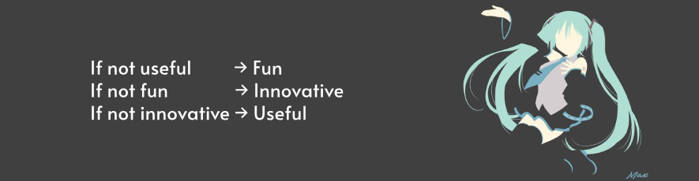

  <h1>👋 hiii, 👋 hello, 👋 haiii !!1!</h1>
  

    I'm <b>Melissa</b>, an amateur programmer with a passion for helping. I primarily make web stuff but I love straying a bit towards other languages like Python and C# (i love OOP). You may find me active in niché Discord servers or posting on Reddit :D
  

  <h2>💻 ⋮ Tech Stack</h2>
  <table>
    <tr>
      <th align="left">IDEs:</th>
      <td>
        
        
        
      </td>
    </tr>
    <tr>
      <th align="left">Languages:</th>
      <td>
        
        
        
        
        
      </td>
    </tr>
    <tr>
      <th align="left">Tools:</th>
      <td>
        
        
        
        
        
      </td>
    </tr>
  </table>

  <h2>🔧 ⋮ Helpful Tools (by me :D)</h2>

  

    <h2>📊 ⋮ Cool Profile Stats</h2>
    <picture>
        <source media="(prefers-color-scheme: dark)" srcset="https://github-readme-stats.vercel.app/api?username=MelissaSievertsson&show_icons=true&theme=github_dark">
        
    </picture>
    <picture>
      <source media="(prefers-color-scheme: dark)" srcset="https://github-readme-stats.vercel.app/api/top-langs/?username=MelissaSievertsson&theme=github_dark">
      
    </picture>

